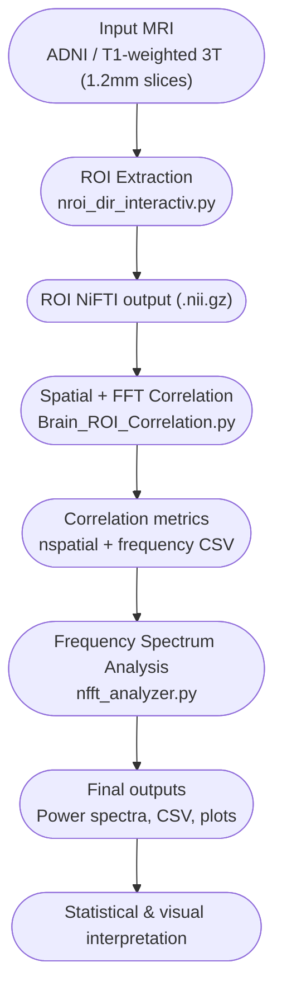
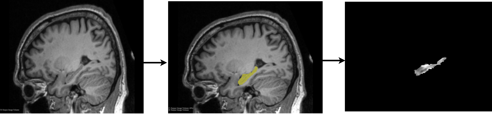
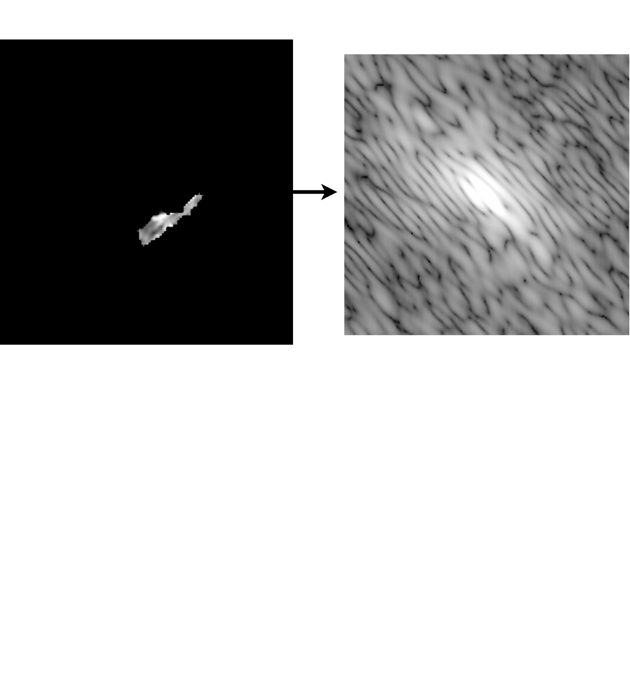

# Alzheimer’s Early Detection (Hippocampal ROI + Correlation + FFT)

[](LICENSE)


[](https://github.com/AmirhoseinNasrollahi/alzheimers-early-detection/actions/workflows/ci.yml)

> A reproducible open-source pipeline for **early detection of Alzheimer’s disease** using hippocampal ROI extraction, spatial & frequency-domain correlation with the MNI atlas, and Fourier-based spectral analysis.

---

##  Project Overview

This repository integrates three reproducible imaging-analysis modules:
1. **ROI extraction** – isolates hippocampal regions from MRI segmentations.  
2. **Spatial/Frequency correlation** – compares hippocampal structure with the MNI atlas both in spatial and Fourier domains.  
3. **Spectral analysis** – profiles the frequency composition of hippocampal ROIs to identify early Alzheimer-related alterations.

All data processing steps are fully modular and transparent, designed for reproducibility in clinical neuroimaging research.

---

##  System Flowchart



---

##  Installation

You can reproduce the pipeline in either `conda` or `pip` environments.

### Option A – Conda
```bash
conda env create -f environment.yml
conda activate alz-early
```

### Option B – Pip
```bash
python -m venv .venv
source .venv/bin/activate  # (Windows: .venv\Scripts\activate)
pip install -r requirements.txt
```

---

##  Quick Start

### 1️⃣ ROI Extraction
```bash
python scripts/roi_dir_interactiv.py   --input_img ./data/input.nii.gz   --input_seg ./data/input.seg   --labels 17 53   --out_nii ./outputs/roi_hippocampus.nii.gz
```

### 2️⃣ Spatial & Frequency Correlation
```bash
python scripts/Brain_ROI_Correlation.py   --roi ./outputs/roi_hippocampus.nii.gz   --mni ./data/mni/MNI152_T1_1mm_brain.nii.gz   --method pearson   --out_csv ./outputs/correlation_metrics.csv
```

### 3️⃣ Frequency Spectrum Analysis
```bash
python scripts/fft_analyzer.py   --input_dir ./outputs/roi_hippocampus_fft   --out_dir ./outputs/fft_results
```

Full documentation for each module is available in the [`docs/`](docs) folder:
- [ROI Extractor](docs/roi_dir_interactive.md)  
- [Brain ROI Correlation](docs/brain_roi_correlation.md)  
- [FFT Analyzer](docs/fft_analyzer.md)

---

##  Data Source and Ethics

MRI data used in this study were obtained from the **Alzheimer’s Disease Neuroimaging Initiative (ADNI)** database under proper data-use agreements.

| Modality | Slices | Field | Type | Thickness | Sequence | #Images | Age range |
|-----------|---------|--------|--------|-------------|-----------|------------|-------------|
| MRI | 176 | 3T | T1-weighted | 1.2 mm | MP-RAGE | 70 per group | 50–70 years |

No raw MRI data are hosted here in respect of participant confidentiality.  
This repository only provides reproducible **code, configurations, and pipeline documentation**, ensuring full transparency without compromising privacy.

---

##  Outputs

Each module produces structured outputs:
- `.nii.gz` – processed hippocampal ROI  
- `.csv` – correlation coefficients & frequency metrics  
- `.png` / `.pdf` – visual spectral profiles  

All outputs are automatically saved under the `/outputs/` directory.

---

##  Repository Structure
```
alzheimers-early-detection/
├─ scripts/
│  ├─ roi_dir_interactiv.py
│  ├─ Brain_ROI_Correlation.py
│  └─ fft_analyzer.py
├─ configs/
│  └─ default.yaml
├─ data/
│  └─ README.md
├─ docs/
│  ├─ roi_dir_interactive.md
│  ├─ brain_roi_correlation.md
│  └─ fft_analyzer.md
├─ requirements.txt
├─ environment.yml
├─ LICENSE
└─ README.md
```

---


### ROI Extraction Example


### FFT Spectrum Example


---
## Contributions
The core concept, research direction, and scientific supervision of this project were provided by Prof. Shahyar Saramad and Prof. Saeed Setayeshi.   The implementation, coding, pipeline development, and data analysis were carried out by  Amirhosein Nasrollahi  under the supervision of Prof. Saramad and Prof. Setayeshi.  

---
##  Citation

If you use this repository, please cite:

```
Nasrollahi, A.; Saramad, S.; Setayeshi, S. (2025). Alzheimer’s Early Detection Using Hippocampal ROI: Four Correlation Measures in Image and Frequency Domains (v1.0.0). GitHub. [https://github.com/AmirhoseinNasrollahi/alzheimers-early-detection]
```

---

##  License
Released under the **MIT License**.  
You are free to use and modify the code with proper attribution.

---

## ✅ Summary
This repository provides an open, reproducible, and ethically responsible implementation for early-stage Alzheimer’s detection research — combining structural MRI processing, hippocampal ROI correlation, and frequency-domain spectral analysis.
