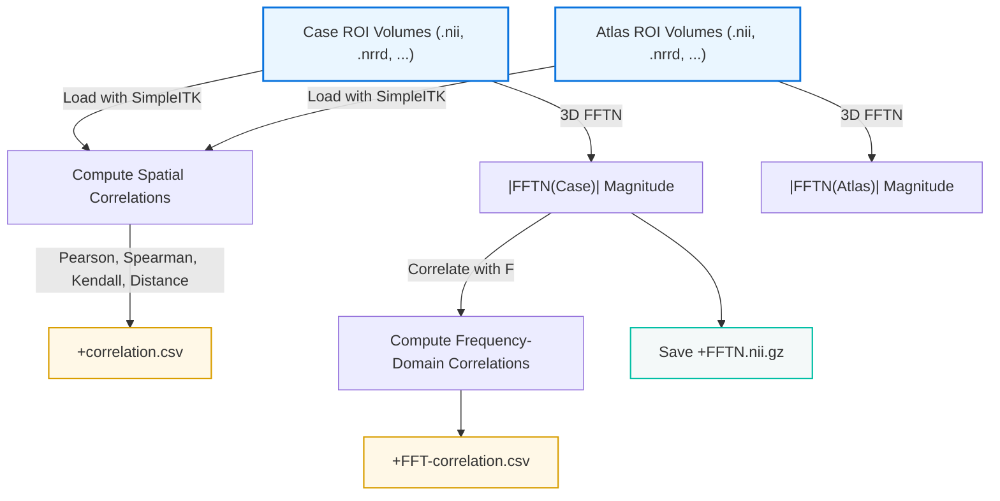

# 🧠 Brain ROI Correlation & FFT

A professional, research-grade CLI tool that merges spatial and frequency-domain correlation analysis for **3D brain ROI volumes**.

---

## 🚀 Overview

This tool computes **voxelwise correlations** between 3D case ROI images and their corresponding atlas volumes — both in the **spatial domain** and in the **frequency domain** (via 3D FFT).

For each case:

- ✅ Loads **3D medical images** (`.nii`, `.nii.gz`, `.nrrd`, `.mha`, `.mhd`)
- 📊 Computes **Pearson**, **Spearman**, **Kendall**, and **Distance Correlation**
- ⚡ Applies **3D FFT** to case and atlas volumes
- 💾 Saves:
  - `<CASE_NAME>+correlation.csv` — spatial domain correlations
  - `<CASE_NAME>+FFTN.nii.gz` — magnitude of FFT volume
  - `<CASE_NAME>+FFT-correlation.csv` — frequency domain correlations

---

## 🧩 Input / Output Data Flow


---

## ⚙️ Usage

### 📥 Installation

```bash
pip install -r requirements.txt
```

*(If you face compatibility issues, see the Conda note below.)*

### ▶️ Run the CLI

```bash
python brain_roi_fft_correlation_cli.py   --cases /path/to/cases_dir   --atlas /path/to/atlas_dir_or_file   --out   /path/to/output_dir
```

---

## 💡 Examples

### Single Atlas for All Cases
```bash
python brain_roi_fft_correlation_cli.py   --cases D:/MRI/Cases   --atlas D:/MRI/Atlas/HIP_Atlas.nii.gz   --out   D:/MRI/Results
```

### Multiple Atlases (matched by filename stem)
```bash
python brain_roi_fft_correlation_cli.py   --cases D:/MRI/Cases   --atlas D:/MRI/Atlas/AtlasParts   --out   D:/MRI/Results   --strict-match
```

### Optional Flags

| Flag | Description |
|------|--------------|
| `--normalize` | Apply Z-score normalization before correlation |
| `--mask-nonzero-union` | Only use voxels where either case **or** atlas ≠ 0 |
| `--fft-shift` | Apply `fftshift` before taking FFT magnitude |
| `--strict-match` | Require exact filename stem match for case–atlas pairing |

---

## 📂 Output Structure

```
/path/to/output_dir/
  Subject001/
    Subject001+correlation.csv
    Subject001+FFTN.nii.gz
    Subject001+FFT-correlation.csv
  Subject002/
    ...
```

### CSV Schema

| Metric   | Correlation |
|-----------|-------------|
| Pearson  | float |
| Spearman | float |
| Kendall  | float |
| Distance | float |

---

## ⚠️ Troubleshooting & Conda Environment Note

If you encounter issues running the code (especially related to the `dcor` library),  
it’s likely due to **Python version compatibility** — `dcor` works best with **Python 3.10**.

✅ **Solution:** Run the script inside a Conda environment:

```bash
conda create -n braincorr python=3.10
conda activate braincorr
pip install -r requirements.txt
python brain_roi_fft_correlation_cli.py --help
```

This ensures all dependencies (especially `SimpleITK` and `dcor`) function correctly.

---

## 🧠 Key Features

- 3D voxelwise correlation analysis (spatial & frequency domains)
- Automated per-case folder creation and CSV export
- FFT magnitude saved as NIfTI with metadata preserved
- Optional masking & normalization to handle real brain volumes
- Supports `.nii`, `.nii.gz`, `.nrrd`, `.mha`, `.mhd`

---

## 📦 Requirements

```
numpy
scipy
pandas
SimpleITK
dcor
tqdm
```

*(All can be installed via pip or Conda.)*

---

## 📜 License

**MIT License**  
Use, modify, and distribute freely with proper credit.

---


