# FFT & Spectral Analysis Pipeline for Brain MRI (NIfTI)

## Overview
This repository provides a **modular, CLI-driven Python pipeline** for computing and analyzing **frequency-domain features** of 3D brain MRI volumes stored in NIfTI format (`.nii` or `.nii.gz`). It performs both:

1. **3D FFT Power Spectrum Computation** — converting spatial-domain MRI volumes into their 3D Fourier magnitude spectra.
2. **Spectral Analysis** — computing radial average profiles, band-limited energy distributions, bootstrap confidence intervals (CIs), and similarity metrics.

The pipeline automatically mirrors the input folder structure in the output directory, ensuring clean, isolated, and traceable data management for large datasets.

---

## Key Features
- 🧠 **NIfTI-compatible**: Works seamlessly with `.nii` and `.nii.gz` volumes.
- ⚡ **FFT Mode**: Computes 3D Fourier transform and saves log-compressed power spectra.
- 📈 **Analyze Mode**: Performs detailed spectral profiling and visualization.
- 📂 **Recursive Input Support**: Processes all volumes in a directory tree.
- 🔄 **Mirrored Output Structure**: Keeps subdirectory hierarchy intact.
- 📊 **Bootstrap Confidence Intervals** for radial and band profiles.
- 🧾 **Manifest File**: Summarizes every processed file, output path, and status.
- 💻 **CLI-Ready**: Simple command-line usage with configurable parameters.

---

## Flow Diagram (Mermaid)

```mermaid
graph TD
    A["Spatial MRI Volumes (.nii or .nii.gz)"] -->|mode=fft| B["3D FFT Power Spectra (log(|F|^2) volumes)"]
    B -->|mode=analyze| C["Spectral Analysis: Radial + Band Profiles"]
    A -->|mode=both| B --> C
    C --> D["CSV Outputs + Plots (mean ± CI)"]
    D --> E["Manifest File (summary of processing)"]

```


---

## Input / Output Structure

### Example Input
```
project_root/
├── subject01/
│   └── t1.nii.gz
├── subject02/
│   └── t1.nii.gz
└── subject03/
    └── t1.nii.gz
```

### Example Output (after `--mode both`)
```
outputs/
├── subject01/
│   ├── fft_t1.nii.gz
│   └── fft_t1/
│       ├── radial_profile_mean_CI.csv
│       ├── band_energies_fractional_mean_CI.csv
│       ├── radial_profiles_mean_CI.png
│       └── band_energies_fractional_mean_CI.png
├── subject02/
│   ├── fft_t1.nii.gz
│   └── fft_t1/...
└── manifest.csv
```

---

## Installation

### Prerequisites
- Python ≥ 3.8
- Packages:
  ```bash
  pip install numpy nibabel pandas matplotlib
  ```


---

## Usage

### 1️⃣ Compute FFT Power Spectra Only
```bash
python fft_analyzer.py --mode fft \
  --input /path/to/spatial_volumes \
  --output /path/to/output_directory \
  --pattern "*.nii.gz"
```

Output: FFT-transformed volumes saved under mirrored folder structure.

### 2️⃣ Perform Spectral Analysis Only
```bash
python fft_analyzer.py --mode analyze \
  --input /path/to/fft_volumes \
  --output /path/to/output_directory \
  --pattern "*.nii.gz" \
  --n-bins 256 --n-bands 8 --n-boot 2000 --ci 0.95 --seed 42
```

Output: Per-volume CSVs and plots for spectral profiles and band-limited energy.

### 3️⃣ Full Pipeline (FFT + Analysis)
```bash
python fft_analyzer.py --mode both \
  --input /path/to/spatial_volumes \
  --output /path/to/output_directory
```

Output includes both FFT volumes and their spectral analysis, all organized cleanly.

---

## Analysis Details

### 🔹 Radial Average Power Spectrum
For each slice, the mean intensity of the FFT magnitude is computed over concentric circles (radial bins), resulting in a **1D radial frequency profile**. This profile is averaged across slices with bootstrapped confidence intervals.

**Outputs:**
- `radial_profile_mean_CI.csv`
- `radial_profiles_mean_CI.png`

**Columns:** `radius_norm`, `mean`, `low`, `high`

### 🔹 Band-Limited Fractional Energy
The FFT magnitude is divided into N radial bands (default=8), and the total energy within each band is computed. Each slice’s band energy is normalized by its total power.

**Outputs:**
- `band_energies_fractional_mean_CI.csv`
- `band_energies_fractional_mean_CI.png`

**Columns:** `band_label`, `band_center`, `mean`, `low`, `high`

### 🔹 Bootstrap Confidence Intervals
For both radial and band analyses, bootstrap resampling is performed across slices (`n_boot=2000`) to estimate 95% CIs of the mean.

---

## Manifest File
A global summary file is created at the root of the output folder:

**`manifest.csv`**
| stage | input | output | status | shape_z_y_x |
|--------|--------|--------|--------|-------------|
| fft | /input/subject01/t1.nii.gz | /output/subject01/fft_t1.nii.gz | ok | [180,256,256] |
| analyze | /output/subject01/fft_t1.nii.gz | /output/subject01/fft_t1 | ok | [180,256,256] |

---

## Processing Summary

| Step | Domain | Operation | Output |
|------|---------|------------|---------|
| **FFT** | Spatial → Frequency | 3D FFT (`np.fft.fftn`) + magnitude² + log compression | Power spectrum volume (`fft_*.nii.gz`) |
| **Radial Profile** | Frequency | Mean intensity vs normalized radius | `radial_profile_mean_CI.csv/png` |
| **Band Energy** | Frequency | Energy ratio across N frequency bands | `band_energies_fractional_mean_CI.csv/png` |
| **Bootstrap CI** | Frequency | 95% confidence intervals per profile/band | CI bounds stored in CSVs |

---

## CLI Parameters
| Argument | Description | Default |
|-----------|--------------|----------|
| `--mode` | `fft`, `analyze`, or `both` | *Required* |
| `--input` | Input root directory | *Required* |
| `--output` | Output root directory | *Required* |
| `--pattern` | File search pattern | `*.nii*` |
| `--n-bins` | Radial bins for profile | `256` |
| `--n-bands` | Frequency bands | `8` |
| `--n-boot` | Bootstrap iterations | `2000` |
| `--ci` | Confidence level | `0.95` |
| `--seed` | RNG seed | `42` |


---

## License
MIT License © 2025 Amirhosein_nasrollahi


---

